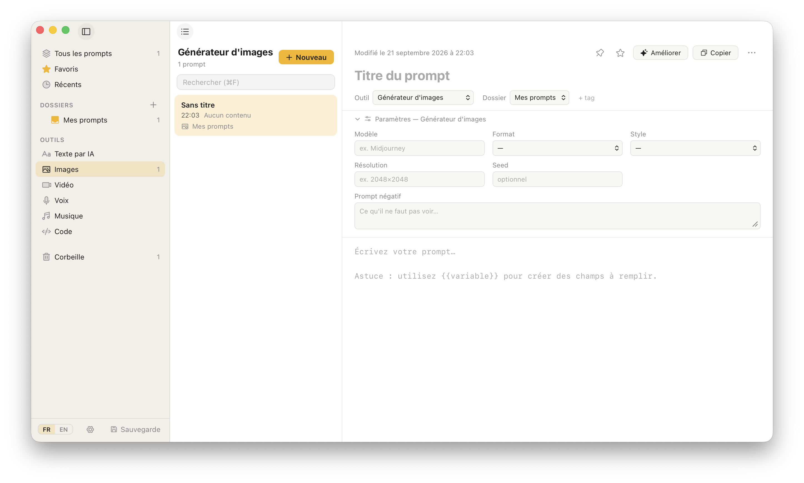

# Emmanuel ROMAIN - 2026
# Pulse-ware
# 
# PromptVault

🇬🇧 [Read in English](README.md)

Gestionnaire de prompts pour macOS, dans l'esprit d'Apple Notes : une arborescence de dossiers, une liste, un éditeur.
Application native légère (Tauri 2 : cœur Rust + interface React), données stockées **localement** dans SQLite.

Repo: <https://github.com/pulse-ware-hub/PromptVault>

<p align="center"></p>

## Fonctionnalités

- **Dossiers** imbriqués ; un nouveau prompt arrive dans « Mes prompts » (dossier par défaut, non supprimable).
- **Outil concerné** pour chaque prompt : texte, image, vidéo, voix, musique, code — avec des **paramètres propres à
  chaque outil** (format d'image, durée de vidéo, langage de code…).
- **Variables** `{{sujet}}` : un formulaire les remplit et copie le prompt complété.
- **Tags** triés par ordre alphabétique, avec complétion (modèles d'IA : Claude, GPT, Midjourney, Suno…).
- Favoris, **épinglage** (prompts épinglés en tête de liste), corbeille (30 jours), historique des versions.
- Recherche instantanée (titre, contenu, tags), glisser-déposer des prompts et des dossiers.
- **Palette globale** `⌥⌘P` : cherchez et collez un prompt dans n'importe quelle application.
- **Amélioration par IA** (Claude ou Gemini) : améliorer, raccourcir, détailler, structurer, corriger, traduire.
- Export **Markdown**, **CSV** et **JSON** (sauvegarde complète) ; import JSON.
- Interface en **français** et en **anglais** (langue du Mac par défaut, modifiable en bas de la barre latérale).
- Thème clair/sombre automatique.

## Prérequis

| Outil | Version testée | Installation |
|---|---|---|
| macOS | 26 (Apple Silicon) | — |
| Outils en ligne de commande Xcode | — | `xcode-select --install` (Xcode complet **non** requis) |
| Node.js + npm | 24 / 11 | <https://nodejs.org> |
| Rust (via rustup) | 1.97 | <https://rustup.rs> |

## Lancement

```bash
cd prompt-vault
npm install
npm run tauri dev
```

La première compilation Rust prend quelques minutes ; les suivantes sont rapides. 
Le frontend se recharge à chaud et le cœur Rust se recompile automatiquement à chaque modification.

| Commande | Rôle |
|---|---|
| `npm run tauri dev` | Application native (SQLite réel, palette, Trousseau) |
| `npm run dev` | Interface seule dans un navigateur, avec un **faux backend en mémoire** (`src/dev-mock.ts`) — pratique pour tester l'UI, sans persistance |
| `npm run build` | Vérification TypeScript + build du frontend |
| `cd src-tauri && cargo test --lib` | Tests du cœur Rust |
| `npm run tauri build -- --bundles app` | Produit `PromptVault.app` (~7 Mo) dans `src-tauri/target/release/bundle/macos/` |

L'application produite n'est **pas signée** : au premier lancement, faites clic droit ▸ **Ouvrir** (Gatekeeper).

## Utilisation

### Raccourcis

| Raccourci | Action |
|---|---|
| `⌘N` / `⇧⌘N` | Nouveau prompt / nouveau dossier |
| `⌘F` | Rechercher |
| `⌥⌘S` / `⌥⌘L` | Replier la barre latérale / la liste des prompts |
| `⌥⌘P` | Palette globale (depuis n'importe quelle application) |

Dans la palette : `↑` `↓` naviguer, `↵` coller, `⌘↵` copier seulement, `Échap` fermer.

Fermer la fenêtre principale la **masque** pour que la palette reste disponible ; `⌘Q` quitte, un clic sur l'icône du
Dock la rouvre.

### Autorisations macOS

- **Accessibilité** (Réglages Système ▸ Confidentialité et sécurité ▸ Accessibilité) : nécessaire pour que la palette
  **colle** automatiquement (`⌘V`) dans l'application précédente. Sans elle, le prompt reste simplement copié dans le
  presse-papier.
- **Automatisation** (System Events) : demandée au premier collage.
- **Trousseau** : demandé au premier enregistrement d'une clé d'IA.

### Amélioration par IA

1. Ouvrez les **Réglages** (engrenage en bas de la barre latérale).
2. Choisissez **Claude** ou **Gemini**, collez votre clé API, puis **Tester la connexion**.
3. Dans l'éditeur, cliquez sur **Améliorer**.

Les clés sont stockées dans le **Trousseau macOS**, jamais dans la base ni dans un fichier. Le texte du prompt est envoyé
au fournisseur choisi. Clés : <https://console.anthropic.com> (Claude) · <https://aistudio.google.com/apikey> (Gemini).
Les modèles par défaut sont modifiables dans les réglages (les identifiants évoluent).

### À propos

Menu **PromptVault ▸ About PromptVault** (menu de l'application), ou **Réglages ▸ À propos de PromptVault…** : auteur, société et numéro de version.

### Données

Base SQLite : `~/Library/Application Support/com.pulseware.promptvault/promptvault.db`.
Sauvegardez-la avec **Sauvegarde ▸ Exporter la bibliothèque (JSON)**. Pour repartir de zéro, quittez l'application et
supprimez ce fichier.

## Structure du projet

```
prompt-vault/
├── archive/              Application précompilée : PromptVault.app (non signée)
├── docs/                 Captures d'écran utilisées dans les README (EN / FR)
├── src/                  Interface React + TypeScript
│   ├── assets/           Icône de l'application et logo Pulse-Ware
│   ├── components/       Sidebar, PromptList, Editor, Palette, AiPanel, SettingsDialog, AboutDialog…
│   ├── i18n/             Dictionnaires fr.ts / en.ts (mêmes clés, vérifiées par le typage)
│   ├── dev-mock.ts       Faux backend (navigateur uniquement)
│   └── styles.css
├── src-tauri/            Cœur Rust
│   ├── icons/            Icônes de l'application (générées depuis l'icône)
│   └── src/
│       ├── store.rs      SQLite : schéma, migrations, recherche FTS5, versions, exports
│       ├── commands.rs   Commandes Tauri exposées à l'interface
│       ├── palette.rs    Raccourci global et fenêtre flottante
│       └── ai.rs         Claude / Gemini, Trousseau macOS
├── LICENSE               GNU AGPL-3.0
└── README.md / LISEZ-MOI.md   Documentation (anglais / français)
```

`archive/PromptVault.app` est une copie prête à l'emploi de l'application : glissez-la dans `/Applications`
(elle n'est **pas signée** : clic droit ▸ **Ouvrir** la première fois). Pour en produire une nouvelle,
voir [Lancement](#lancement).

## Dépannage

| Symptôme | Piste |
|---|---|
| `Port 1420 is already in use` | Un autre `tauri dev` / `vite` tourne : `pkill -f vite`, ou fermez l'ancien |
| `⌥⌘P` sans effet | Un autre logiciel utilise déjà ce raccourci ; vérifiez la console de `tauri dev` |
| La palette copie mais ne colle pas | Autorisez PromptVault dans Confidentialité ▸ **Accessibilité** |
| Erreur « clé refusée » | Clé invalide ou sans droits ; réenregistrez-la dans les Réglages |
| `cargo` : erreur sur `serde` | Après avoir modifié `Cargo.toml`, lancez `cargo build` (et pas seulement `cargo test`) |

## Google Drive — créer l'identifiant OAuth

> **La synchronisation Google Drive n'est pas encore implémentée.** Ce guide prépare l'identifiant nécessaire ; l'application
> le demandera dans les Réglages une fois la fonction livrée. L'interface de Google évolue : les libellés ci-dessous
> peuvent différer légèrement.

L'application demandera uniquement la portée `https://www.googleapis.com/auth/drive.appdata` : 
un espace **caché et réservé à PromptVault** dans votre Drive. Elle ne voit et ne modifie **aucun** de vos autres fichiers.

1. **Créer un projet.** Ouvrez la [console Google Cloud](https://console.cloud.google.com), puis le sélecteur de projet
   ▸ **Nouveau projet** (par exemple « PromptVault »).
2. **Activer l'API Drive.** *API et services ▸ Bibliothèque* ▸ cherchez **Google Drive API** ▸ **Activer**.
3. **Configurer l'écran de consentement.** *API et services ▸ Écran de consentement OAuth* (ou *Google Auth Platform*) :
   - Type d'utilisateur : **Externe** ; renseignez le nom de l'application et votre e-mail d'assistance.
   - *Accès aux données* (Scopes) : ajoutez `.../auth/drive.appdata`.
   - Tant que l'application est en mode **Test**, ajoutez votre compte Google dans **Utilisateurs de test** — sinon la
     connexion est refusée.
4. **Créer l'identifiant.** 
     *API et services ▸ Identifiants ▸ Créer des identifiants ▸ ID client OAuth* :
   - Type d'application : **Application de bureau**.
   - Nom : « PromptVault ». Validez.
5. **Récupérer les valeurs.** Notez l'**ID client** et le **code secret du client** (ou téléchargez le JSON). 
   Pour une application de bureau, ce secret n'est pas confidentiel au sens strict, mais ne le publiez pas pour autant.
6. **Renseigner PromptVault** (dès que la fonction sera livrée) : *Réglages ▸ Google Drive*, collez l'ID client et le
   secret. Ils seront rangés dans le Trousseau macOS, comme les clés d'IA. La connexion s'ouvre dans votre navigateur et
   revient sur une adresse locale (`http://127.0.0.1`), sans rien à configurer de plus.

À savoir :
- En mode **Test**, Google fait expirer l'autorisation au bout de **7 jours** : il faudra se reconnecter chaque semaine.
  Pour éviter cela, passez l'écran de consentement en **En production** (*Publier l'application*). Pour un usage
  personnel, Google peut afficher « application non validée » : *Paramètres avancés ▸ Continuer*.
- Ne **commitez jamais** l'ID client / le secret dans un dépôt.
- Révoquer l'accès : <https://myaccount.google.com/permissions>.

## Désinstallation de l'application
Supprimez le fichier `PromptVault.app`, vérifiez que le répertoire est vide ou supprimé : 
`~/Library/Application Support/com.pulseware.promptvault/`

## Licence

<p></p>

Emmanuel ROMAIN - 2026  
Pulse-Ware

GNU AGPL-3.0 — voir [`LICENSE`](LICENSE).